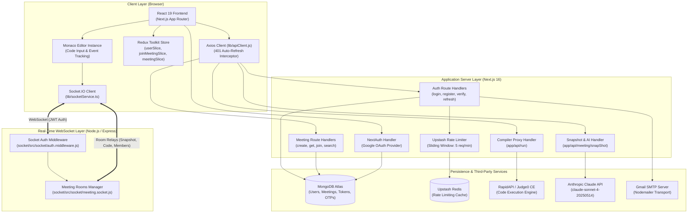
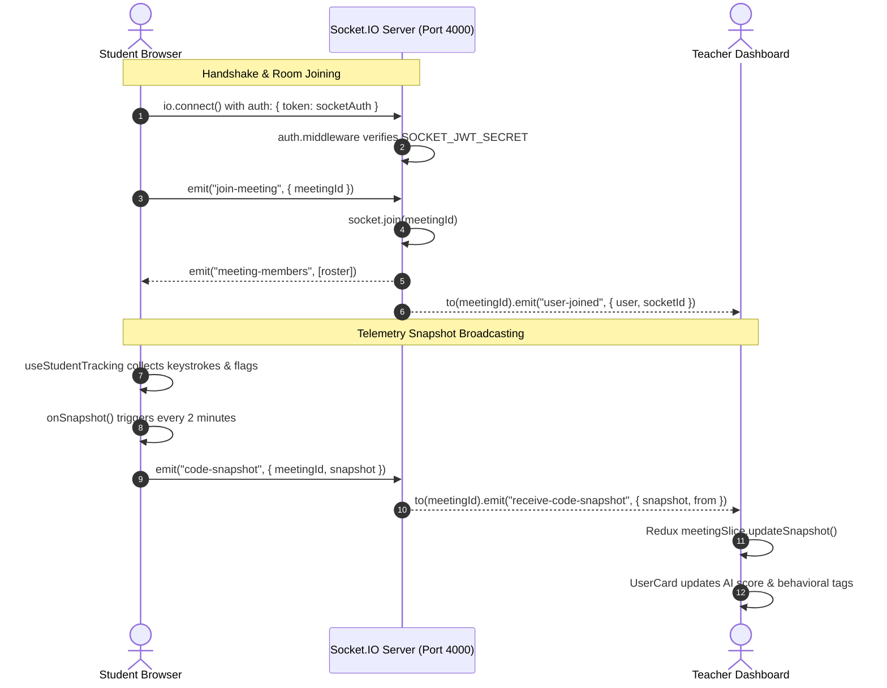

# System Architecture

## 1. High-Level Architecture Diagram

---

## 2. Process Boundaries

The repository operates as a distributed multi-process system:

### 2.1 Process 1: Next.js Web & API Server
- **Entry Point**: Built and served through standard Next.js CLI scripts defined in [`package.json`](file:///c:/Users/AmanNagar/teachview-live/package.json) (`next dev` / `next start`).
- **Port**: Default `3000`.
- **Responsibilities**:
  - Serves Server-Side Rendered (SSR) layouts and Client Components.
  - Hosts Next.js App Router API Route Handlers under [`app/api/`](file:///c:/Users/AmanNagar/teachview-live/app/api).
  - Handles database connectivity via Mongoose singleton ([`lib/db.js`](file:///c:/Users/AmanNagar/teachview-live/lib/db.js)).
  - Proxies code execution requests to Judge0 on RapidAPI.
  - Evaluates student heuristics and constructs AI prompts for Anthropic Claude.

### 2.2 Process 2: Standalone Socket.IO Server
- **Entry Points**:
  - Modular implementation: [`socket/src/index.js`](file:///c:/Users/AmanNagar/teachview-live/socket/src/index.js) (Port `4000`).
  - Standalone script: [`socket/server.js`](file:///c:/Users/AmanNagar/teachview-live/socket/server.js) (Port `3001`).
- **Responsibilities**:
  - Maintains persistent stateful WebSocket connections with clients.
  - Manages Socket.IO rooms partitioned by `meetingId`.
  - Relays student telemetry snapshots (`code-snapshot`) to teachers in real time.
  - Tracks user connection lifecycle (`join-meeting`, `user-joined`, `user-left`, `meeting-members`).

---

## 3. Client vs. Server Boundaries

| Domain | Server-Side Responsibility | Client-Side Responsibility |
|---|---|---|
| **Authentication** | Validates credentials, signs 15-min Access Tokens, creates 7-day Refresh Tokens, hashes tokens in DB, sets HTTP-only cookies. | Stores Access Token in memory ([`lib/apiClient.js`](file:///c:/Users/AmanNagar/teachview-live/lib/apiClient.js)), transparently requests token refreshes on 401 response, bootstraps user profile in Redux store. |
| **Room Management** | Verifies permissions, adds user IDs to `Meeting.members` array, signs 60-min `socketAuth` token. | Searches meetings using debounced regex queries, drives 3-step join stepper, saves `socketAuth` in `sessionStorage`. |
| **Code Execution** | Sanitizes request payload, forwards execution payload to Judge0 via RapidAPI headers (`x-rapidapi-key`). | Monaco editor inputs code, displays output with syntax/runtime error styling. |
| **Behavioral Tracking** | Normalizes metrics in `buildBehaviorContext`, prompts Claude AI for engagement scoring and teaching recommendations. | [`UseStudentTracking.js`](file:///c:/Users/AmanNagar/teachview-live/app/meeting/member/%5Bid%5D/@right/user-code/UseStudentTracking.js) attaches listeners to Monaco editor, tracking keystrokes, pastes, idle times, and tab switches without triggering UI re-renders. |

---

## 4. Real-Time Communication Architecture

---

## 5. Security and Rate-Limiting Model

1. **Sliding Window Rate Limiting**:
   - Implemented via `@upstash/ratelimit` in [`lib/rateLimiter.js`](file:///c:/Users/AmanNagar/teachview-live/lib/rateLimiter.js) backed by Upstash Redis REST API.
   - Enforces a limit of **5 requests per 1 minute** on sensitive public endpoints:
     - [`POST /api/login`](file:///c:/Users/AmanNagar/teachview-live/app/api/login/route.js)
     - [`POST /api/login/register`](file:///c:/Users/AmanNagar/teachview-live/app/api/login/register/route.js)
     - [`POST /api/login/forgotpassword/generateOTP`](file:///c:/Users/AmanNagar/teachview-live/app/api/login/forgotpassword/generateOTP/route.js)
     - [`POST /api/login/forgotpassword/verifyOTP`](file:///c:/Users/AmanNagar/teachview-live/app/api/login/forgotpassword/verifyOTP/route.js)
     - [`POST /api/login/forgotpassword/changepassword`](file:///c:/Users/AmanNagar/teachview-live/app/api/login/forgotpassword/changepassword/route.js)
   - Rejection response: HTTP 429 `{ success: false, message: "Too many requests" }`.
2. **Cryptographic Token Hashing**:
   - Refresh tokens and email verification tokens are never stored in raw text in MongoDB.
   - [`lib/hashToken.js`](file:///c:/Users/AmanNagar/teachview-live/lib/hashToken.js) hashes raw strings using `crypto.createHash("sha256")`.
3. **Password Security**:
   - Passwords are salted and hashed using `bcrypt.hash(password, 10)`.
   - In Mongoose schema [`models/User.model.js`](file:///c:/Users/AmanNagar/teachview-live/models/User.model.js), `password` is set to `select: false` so accidental queries do not leak password hashes.
