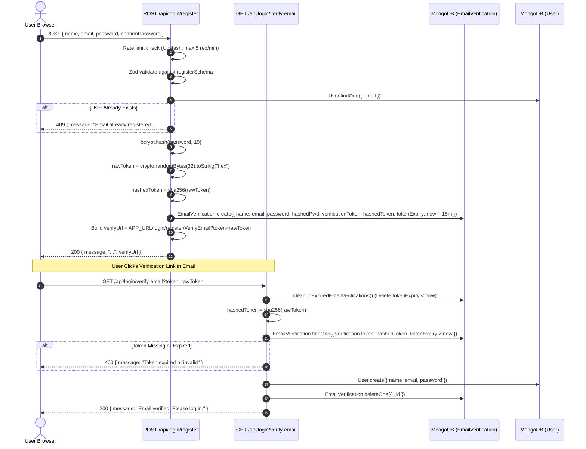
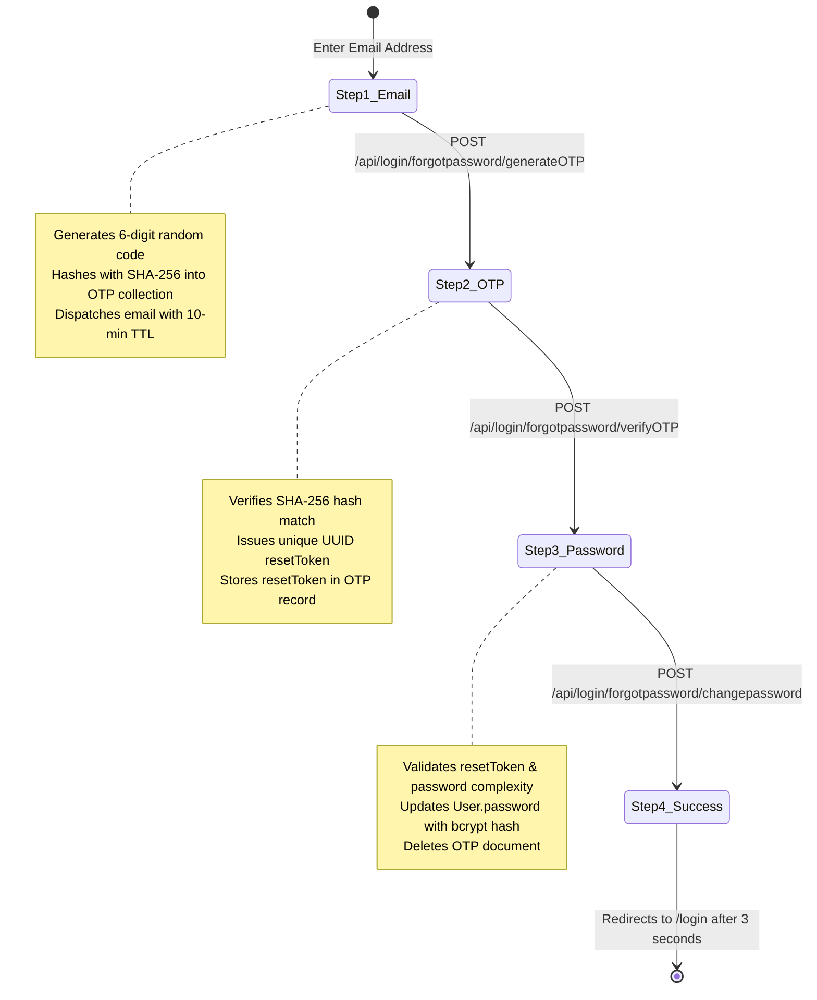

# Authentication & Authorization Architecture

VibeCodeLive employs a hardened authentication system combining **Dual-Token JWTs with Token Rotation**, **Staged Email Verification**, **Rate-Limited OTP Password Recovery**, and **Google OAuth 2.0 via NextAuth**.

---

## 1. Dual-Token JWT Architecture

### 1.1 Token Specifications

| Attribute | Access Token | Refresh Token |
|---|---|---|
| **Lifespan** | 15 minutes (`15m`) | 7 days (`7d`) |
| **Signing Secret** | `process.env.ACCESS_TOKEN_SECRET` | `process.env.REFRESH_TOKEN_SECRET` |
| **Payload** | `{ userId: user._id, email: user.email }` | `{ userId: user._id }` |
| **Client Storage** | In-Memory (JavaScript variable in [`lib/apiClient.js`](file:///c:/Users/AmanNagar/teachview-live/lib/apiClient.js)) | HTTP-Only Secure Cookie (`refreshToken`) |
| **Server Storage** | Stateless (not in DB) | SHA-256 Hashed in MongoDB ([`models/RefreshToken.js`](file:///c:/Users/AmanNagar/teachview-live/models/RefreshToken.js)) |
| **Generator** | [`generateAccessToken(user)`](file:///c:/Users/AmanNagar/teachview-live/lib/tokens.js#L3) | [`generateRefreshToken(user)`](file:///c:/Users/AmanNagar/teachview-live/lib/tokens.js#L16) |

---

## 2. Refresh Token Rotation Lifecycle

When a client hits an expired access token, the client transparently requests a new one. The server validates the refresh token and automatically **rotates** it if it is within 24 hours of expiration.

```mermaid
sequenceDiagram
    autonumber
    actor Client as Browser / Axios
    participant Route as POST /api/login/refresh
    participant DB as MongoDB (RefreshToken)
    participant UserDB as MongoDB (User)

    Client->>Route: POST /api/login/refresh (Cookie: refreshToken)
    Route->>Route: Extract refreshToken from request cookies
    alt No Cookie Present
        Route-->>Client: 401 { message: "Refresh token missing" }
    end

    Route->>Route: jwt.verify(refreshToken, REFRESH_TOKEN_SECRET)
    alt Invalid Signature or Expired JWT
        Route-->>Client: 401 { message: "Invalid refresh token" }
    end

    Route->>Route: tokenHash = hashToken(refreshToken) (SHA-256)
    Route->>DB: RefreshToken.findOne({ tokenHash })
    alt Token Hash Not Found
        Route-->>Client: 401 { message: "Refresh token expired or revoked" }
    end

    Route->>UserDB: User.findById(storedToken.userId)
    Route->>Route: newAccessToken = generateAccessToken(user)

    Note over Route,DB: Rotation Check (Threshold = 24 Hours)
    alt (storedToken.expiresAt - now) < 24 Hours
        Route->>DB: RefreshToken.deleteOne({ tokenHash })
        Route->>Route: newRefreshToken = generateRefreshToken(user)
        Route->>DB: RefreshToken.create({ userId, tokenHash: hash(newRefreshToken), expiresAt: now + 7d })
        Route->>Client: Set-Cookie: refreshToken=newRefreshToken; HttpOnly; SameSite=lax; Path=/
    end

    Route-->>Client: 200 { accessToken: newAccessToken }
```

---

## 3. Registration & Staged Email Verification Flow

To prevent unverified accounts from cluttering the primary collection, users are initially staged in [`models/EmailVerification.js`](file:///c:/Users/AmanNagar/teachview-live/models/EmailVerification.js). Once the email token is verified, the document is migrated to [`models/User.model.js`](file:///c:/Users/AmanNagar/teachview-live/models/User.model.js).



---

## 4. Google OAuth via NextAuth

Defined in [`app/api/auth/[...nextauth]/route.ts`](file:///c:/Users/AmanNagar/teachview-live/app/api/auth/%5B...nextauth%5D/route.ts):

1. **`signIn` Callback**:
   - Checks if user exists by email in [`User`](file:///c:/Users/AmanNagar/teachview-live/models/User.model.js).
   - If missing, creates a new user document with `provider: "google"`.
2. **`jwt` Callback**:
   - Generates an application `accessToken` (15m) and `refreshToken` (7d).
   - Hashes the refresh token and inserts a record in [`models/RefreshToken.js`](file:///c:/Users/AmanNagar/teachview-live/models/RefreshToken.js).
   - Sets the HTTP-only `refreshToken` cookie on the client response:
     ```typescript
     cookiesList.set("refreshToken", refreshToken, {
       httpOnly: true,
       secure: true,
       sameSite: "lax",
       path: "/",
       maxAge: 60 * 60 * 24 * 7,
     });
     ```
   - Appends `accessToken` and `userId` to the NextAuth JWT token object.
3. **`session` Callback**:
   - Exposes `accessToken` and `user.id` on the client-side NextAuth `session` object.

---

## 5. Password Recovery via 6-Digit OTP

Managed through a 4-step state machine in [`app/login/forget-password/Forms.jsx`](file:///c:/Users/AmanNagar/teachview-live/app/login/forget-password/Forms.jsx):



---

## 6. Route & API Authorization Guard

Protected API routes verify authorization using [`lib/getUserFromRequest.js`](file:///c:/Users/AmanNagar/teachview-live/lib/getUserFromRequest.js):

```javascript
// Usage Example in API Route Handler:
import { getUserFromRequest } from "@/lib/getUserFromRequest";

export async function POST(req) {
  // Throws ApiError(401) if authorization header is absent or token is invalid/expired
  const decodedUser = getUserFromRequest(req);
  const userId = decodedUser.userId;
  // ... proceed with authenticated logic
}
```

The decoded JWT payload provides:
- `decodedUser.userId`: MongoDB ObjectId string for the user.
- `decodedUser.email`: Registered email string.
