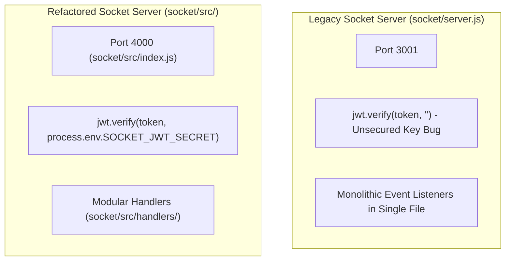

# Backend Architecture & Services

This document details the backend architecture of **TeachView Live**, covering Next.js API Route Handlers, authentication guards, rate-limiting layers, and the dual Socket.IO real-time servers.

---

## 1. Architecture Overview

TeachView Live follows a hybrid architecture:
- **Stateless REST Layer**: Next.js App Router Route Handlers (`app/api/**/route.js`) handling authentication, meeting metadata, code execution proxies, and telemetry AI evaluations.
- **Stateful Real-Time Layer**: Standalone Node.js Socket.IO server daemon handling live room orchestration, code synchronization, chat messaging, and telemetry broadcasting.
- **Persistence Layer**: MongoDB Atlas accessed via Mongoose singleton connection with connection pooling.
- **Cache & Rate-Limit Layer**: Upstash Redis enforcing sliding-window rate limits on public and high-cost endpoints.

```mermaid
graph TD
    Client["Frontend Clients (Student / Teacher)"]
    
    subgraph "Next.js App Router (REST Layer)"
        Routes["API Route Handlers (/api/*)"]
        Guard["getUserFromRequest.js (JWT Guard)"]
        Limiter["lib/rateLimit.js (Upstash Redis)"]
        AI["utils/sessionSummary.js (Gemini / Heuristics)"]
        Mailer["utils/sendEmail.js (Nodemailer)"]
    end
    
    subgraph "Socket.IO Server Daemon"
        Socket["socket/server.js (:3001) / socket/src (:4000)"]
        Rooms["Room Subscriptions (meeting_id)"]
    end
    
    subgraph "External & Data Infrastructure"
        DB[(MongoDB Atlas)]
        Redis[(Upstash Redis)]
        Judge0["Judge0 Sandbox Engine"]
        Gemini["Google Gemini AI API"]
    end

    Client -->|HTTP REST| Limiter
    Limiter --> Routes
    Routes --> Guard
    Routes --> DB
    Routes --> Mailer
    Routes --> AI
    AI --> Gemini
    Routes -->|Judge0 Submissions| Judge0
    
    Client <-->|WebSockets (WSS/WS)| Socket
    Socket --> Rooms
```

---

## 2. Request Guards & Security Middleware

### 1. JWT Authentication Guard (`getUserFromRequest.js`)
- **File**: [`lib/getUserFromRequest.js`](file:///c:/Users/AmanNagar/teachview-live/lib/getUserFromRequest.js)
- **Mechanism**:
  1. Extracts the `Authorization` header from the incoming `NextRequest`.
  2. Strips the `Bearer ` prefix.
  3. Verifies the token signature using `jsonwebtoken` against `process.env.JWT_SECRET`.
  4. Decodes and returns the user payload (`{ userId, email, role }`).
  5. Throws an explicit error with status code `401` if the token is missing, expired, or tampered with.

### 2. Upstash Sliding Window Rate Limiter (`lib/rateLimit.js`)
- **File**: [`lib/rateLimit.js`](file:///c:/Users/AmanNagar/teachview-live/lib/rateLimit.js)
- **Backing Service**: `@upstash/ratelimit` connected to `@upstash/redis`.
- **Limiter Configurations**:
  | Limiter Instance | Window Configuration | Protected Endpoints | Action on Breach |
  |---|---|---|---|
  | `authLimiter` | 5 requests per 15 minutes | `/api/login`, `/api/register`, `/api/forgotPassword` | Returns HTTP `429 Too Many Requests` |
  | `codeExecutionLimiter` | 10 requests per 1 minute | `/api/run` | Returns HTTP `429` with retry time |
  | `apiLimiter` | 100 requests per 1 minute | General meeting APIs | Returns HTTP `429` |

---

## 3. Remote Code Execution Pipeline (`app/api/run`)

- **File**: [`app/api/run/route.js`](file:///c:/Users/AmanNagar/teachview-live/app/api/run/route.js)
- **Downstream Sandbox**: Judge0 API (RapidAPI or self-hosted CE).

### Execution Flow
1. Validates request body containing `language_id` (numeric), `source_code` (string), and optional `stdin` (string).
2. Applies `codeExecutionLimiter` based on client IP or user ID.
3. Forwards submission to Judge0:
   ```http
   POST https://judge0-ce.p.rapidapi.com/submissions?base64_encoded=false&wait=true
   Content-Type: application/json
   X-RapidAPI-Key: <RAPIDAPI_KEY>
   X-RapidAPI-Host: judge0-ce.p.rapidapi.com
   ```
4. Parses execution result:
   - `stdout`: Standard console output.
   - `stderr`: Standard error stream.
   - `compile_output`: Compiler error diagnostics.
   - `time`: CPU execution time in seconds.
   - `memory`: Memory consumption in kilobytes.
   - `status`: Execution status object (e.g. `Accepted`, `Time Limit Exceeded`, `Compilation Error`).
5. Returns normalized execution response to the client terminal.

---

## 4. AI & Heuristic Snapshot Evaluation (`app/api/meeting/snapShot`)

- **File**: [`app/api/meeting/snapShot/route.js`](file:///c:/Users/AmanNagar/teachview-live/app/api/meeting/snapShot/route.js)
- **Utility**: [`utils/sessionSummary.js`](file:///c:/Users/AmanNagar/teachview-live/utils/sessionSummary.js)

### Scoring Algorithm
The scoring engine computes an integrity rating from `0` to `100` based on real-time telemetry metrics:

$$\text{Score} = 100 - (\text{TabSwitchPenalty} + \text{PastePenalty} + \text{NoCodePenalty})$$

Where:
- $\text{TabSwitchPenalty} = \min(45, \text{tabSwitchCount} \times 15)$
- $\text{PastePenalty} = \min(40, \text{pasteCount} \times 20)$
- $\text{NoCodePenalty} = 50 \text{ if characterCount} < 10 \text{ else } 0$

### 5-Point Briefing Model
When Gemini API key (`GEMINI_API_KEY`) is present, a structured LLM request analyzes the code delta, typing rhythm, and telemetry flags to generate:
1. **Behavioral Overview**: Student's active focus and rhythm.
2. **Code Progress**: Features implemented, algorithm structure, test readiness.
3. **Integrity Alerts**: Tab-switching patterns, suspicious large paste insertions.
4. **Code Quality**: Syntax validity, edge case handling, code style.
5. **Teacher Recommendation**: Suggested intervention (e.g. "Ask student to explain lines 15-28").

*Fallback Mode*: If the AI service is unreachable or unconfigured, `sessionSummary.js` provides deterministic rule-based output preserving the exact 5-point format without failing the request.

---

## 5. Socket.IO Real-Time Architecture

The repository contains two Socket server implementations reflecting an ongoing refactor.

### Comparative Implementation Analysis



| Dimension | `socket/server.js` | `socket/src/index.js` |
|---|---|---|
| **Port** | 3001 | 4000 |
| **Token Verification** | `jwt.verify(token, "")` *(empty string bug)* | `jwt.verify(token, process.env.SOCKET_JWT_SECRET)` |
| **Structure** | Single monolithic file | Modular routes, handlers, and room models |
| **Active Target** | Referenced by default client configs | Production target for upcoming release |

### Socket.IO Event Catalogue

#### Client $\rightarrow$ Server Events
| Event Name | Payload Schema | Handler Action |
|---|---|---|
| `join-room` / `join-meeting` | `{ roomId: string, role: "teacher" \| "student", name: string, customResponses?: object }` | Adds socket to room `meeting_${roomId}`, notifies host with `user-joined` |
| `code-change` / `code-update` | `{ roomId: string, code: string, language: string, studentId: string }` | Broadcasts live code updates to host |
| `code-snapshot` | `{ roomId: string, studentId: string, score: number, summary: object, metrics: object }` | Broadcasts 2-minute scored snapshot to instructor |
| `send-message` | `{ roomId: string, sender: string, message: string, timestamp: number }` | Relays chat message to all room members |
| `disconnect` | None | Cleans up socket from room, emits `user-left` to host |

#### Server $\rightarrow$ Client Events
| Event Name | Payload Schema | Target Receiver |
|---|---|---|
| `room-joined` | `{ roomId: string, participants: array }` | Joining Client |
| `user-joined` | `{ userId: string, name: string, role: string, customResponses: object }` | Host / Meeting Members |
| `receive-code-update` | `{ studentId: string, code: string, language: string }` | Host (when inspecting code) |
| `receive-code-snapshot`| `{ studentId: string, score: number, summary: object, metrics: object }` | Host Dashboard (`meetingSlice`) |
| `receive-message` | `{ sender: string, message: string, timestamp: number }` | All Room Members |
| `user-left` | `{ userId: string }` | Host Dashboard |
