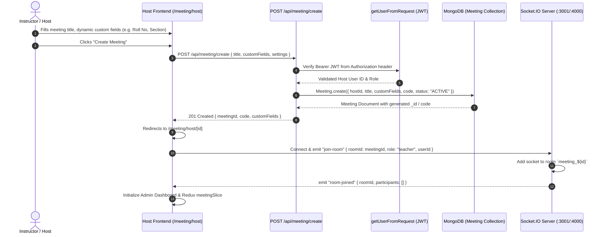
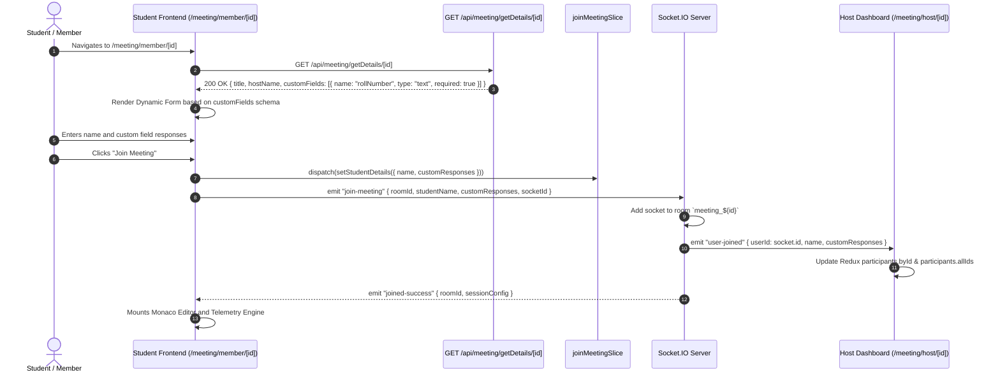
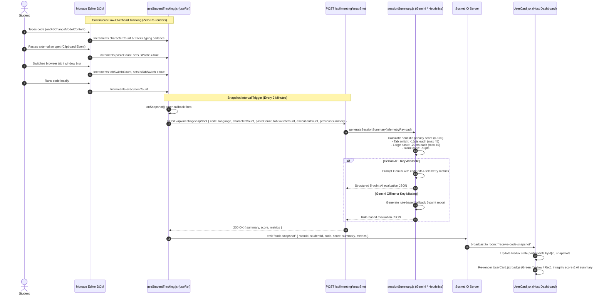
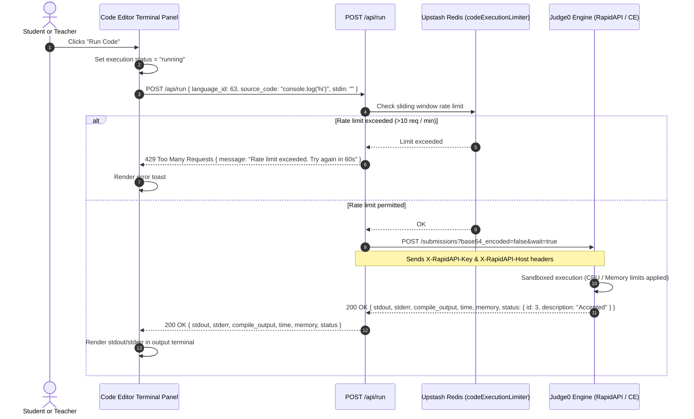
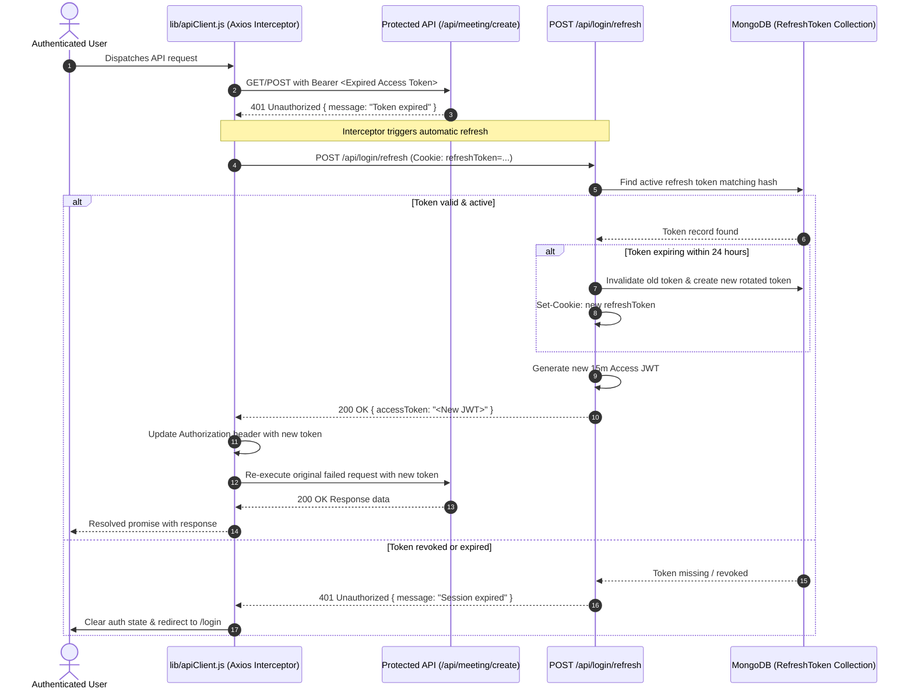

# Data Flows & Interaction Pipelines

This document details the primary runtime data flows, request lifecycles, and event-driven pipelines in **TeachView Live**. Each flow is mapped directly to its underlying source files and includes a Mermaid sequence diagram.

---

## 1. Meeting Creation & Host Initialization Flow

The host (instructor/admin) creates a monitored coding session, configures custom entry fields, and initializes the real-time monitoring room.

### Sequence Diagram

### Source File Trace
- **Host Form**: [`app/meeting/host/create/page.jsx`](file:///c:/Users/AmanNagar/teachview-live/app/meeting/host/create/page.jsx)
- **Meeting Creation Handler**: [`app/api/meeting/create/route.js`](file:///c:/Users/AmanNagar/teachview-live/app/api/meeting/create/route.js)
- **Token Verification**: [`lib/getUserFromRequest.js`](file:///c:/Users/AmanNagar/teachview-live/lib/getUserFromRequest.js)
- **Meeting Schema**: [`models/Meeting.js`](file:///c:/Users/AmanNagar/teachview-live/models/Meeting.js)
- **Host Live Dashboard**: [`app/meeting/host/[id]/page.jsx`](file:///c:/Users/AmanNagar/teachview-live/app/meeting/host/%5Bid%5D/page.jsx)
- **Socket Client Service**: [`lib/socketService.ts`](file:///c:/Users/AmanNagar/teachview-live/lib/socketService.ts)

---

## 2. Student Discovery & Join Request Flow

Students enter via a shared meeting link, complete custom dynamic fields configured by the host, and join the session room.

### Sequence Diagram

### Source File Trace
- **Student Join Page**: [`app/meeting/member/[id]/page.jsx`](file:///c:/Users/AmanNagar/teachview-live/app/meeting/member/%5Bid%5D/page.jsx)
- **Meeting Info API**: [`app/api/meeting/getDetails/[id]/route.js`](file:///c:/Users/AmanNagar/teachview-live/app/api/meeting/getDetails/%5Bid%5D/route.js)
- **Join State Store**: [`store/joinMeetingSlice.js`](file:///c:/Users/AmanNagar/teachview-live/store/joinMeetingSlice.js)
- **Meeting Store (Host Side)**: [`store/meetingSlice.ts`](file:///c:/Users/AmanNagar/teachview-live/store/meetingSlice.ts)

---

## 3. Real-Time Telemetry & AI Snapshot Pipeline

The core integrity pipeline monitors student activity in Monaco Editor without causing React re-renders, aggregates telemetry metrics, passes snapshots to Google Gemini / heuristic evaluator, and broadcasts integrity summaries to the instructor.

### Sequence Diagram

### Telemetry Pipeline Specifications
1. **Zero-Rerender Hook**: [`app/meeting/member/[id]/@right/user-code/UseStudentTracking.js`](file:///c:/Users/AmanNagar/teachview-live/app/meeting/member/%5Bid%5D/@right/user-code/UseStudentTracking.js) uses mutable `useRef` instances for all counters to prevent typing lag or re-render thrashing.
2. **Snapshot API Controller**: [`app/api/meeting/snapShot/route.js`](file:///c:/Users/AmanNagar/teachview-live/app/api/meeting/snapShot/route.js) enforces validation and coordinates score generation.
3. **Scoring & Prompt Utility**: [`utils/sessionSummary.js`](file:///c:/Users/AmanNagar/teachview-live/utils/sessionSummary.js) defines mathematical heuristics, fallback generators, and structured prompts.
4. **Host Card Component**: [`components/admin/UserCard.jsx`](file:///c:/Users/AmanNagar/teachview-live/components/admin/UserCard.jsx) renders the score meter, tab switch counter, paste warnings, and AI briefing modal.

---

## 4. Remote Code Execution Flow (Judge0 Integration)

Code submitted by students or teachers is executed in a sandboxed environment via the Judge0 API with Upstash rate limiting.

### Sequence Diagram

### Source File Trace
- **Code Execution API**: [`app/api/run/route.js`](file:///c:/Users/AmanNagar/teachview-live/app/api/run/route.js)
- **Rate Limiting Guard**: [`lib/rateLimit.js`](file:///c:/Users/AmanNagar/teachview-live/lib/rateLimit.js) (`codeExecutionLimiter`)
- **Editor Output Component**: [`components/Terminal.jsx`](file:///c:/Users/AmanNagar/teachview-live/components/Terminal.jsx) / [`components/CodeEditor.jsx`](file:///c:/Users/AmanNagar/teachview-live/components/CodeEditor.jsx)

---

## 5. Authentication & Token Refresh Flow

The dual-token system uses short-lived (15-minute) Access JWTs and long-lived (7-day) Refresh Tokens stored in the database and an HTTP-only cookie.

### Sequence Diagram

### Source File Trace
- **HTTP Client Interceptor**: [`lib/apiClient.js`](file:///c:/Users/AmanNagar/teachview-live/lib/apiClient.js)
- **Token Refresh Handler**: [`app/api/login/refresh/route.js`](file:///c:/Users/AmanNagar/teachview-live/app/api/login/refresh/route.js)
- **Token Generator & Verifier**: [`lib/jwt.js`](file:///c:/Users/AmanNagar/teachview-live/lib/jwt.js)
- **Refresh Token Collection**: [`models/RefreshToken.js`](file:///c:/Users/AmanNagar/teachview-live/models/RefreshToken.js)

> [!WARNING]
> **Known Client-Side Bug**: In [`lib/apiClient.js`](file:///c:/Users/AmanNagar/teachview-live/lib/apiClient.js#L38-L43), the interceptor calls `/api/auth/jwt` to refresh tokens instead of the actual endpoint [`/api/login/refresh`](file:///c:/Users/AmanNagar/teachview-live/app/api/login/refresh/route.js). Refer to [`docs/deployment.md`](file:///c:/Users/AmanNagar/teachview-live/docs/deployment.md) for remediation details.
