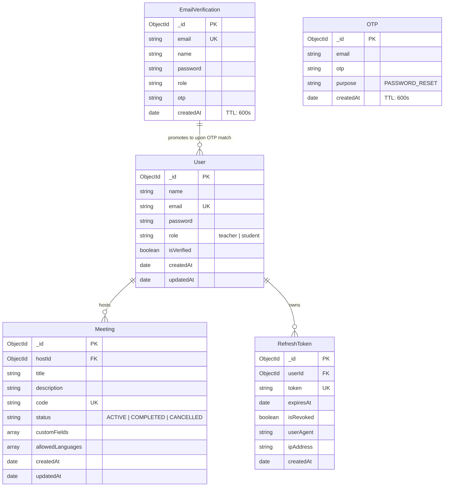

# Database Architecture & Data Models

This document details the MongoDB Atlas database architecture for **TeachView Live**, including connection lifecycle management, entity relationships, Mongoose schema models, indexing strategies, and automated TTL cleanup.

---

## 1. Connection Lifecycle & Pooling (`lib/db.js`)

- **File**: [`lib/db.js`](file:///c:/Users/AmanNagar/teachview-live/lib/db.js)
- **Driver**: Mongoose 9.x / MongoDB Native Driver

### Serverless Connection Caching Pattern
Next.js API route handlers execute in serverless or hot-reloading Node.js runtimes. Establishing a new database connection on every incoming request quickly saturates MongoDB Atlas connection limits.

`lib/db.js` implements a global caching pattern:

```javascript
let cached = global.mongoose;

if (!cached) {
  cached = global.mongoose = { conn: null, promise: null };
}

async function dbConnect() {
  if (cached.conn) {
    return cached.conn;
  }

  if (!cached.promise) {
    const opts = {
      bufferCommands: false,
    };

    cached.promise = mongoose.connect(MONGODB_URI, opts).then((mongoose) => {
      return mongoose;
    });
  }

  try {
    cached.conn = await cached.promise;
  } catch (e) {
    cached.promise = null;
    throw e;
  }

  return cached.conn;
}
```

---

## 2. Entity Relationship Diagram



---

## 3. Mongoose Model Specifications

### 1. `User` Model
- **File**: [`models/User.js`](file:///c:/Users/AmanNagar/teachview-live/models/User.js)
- **Collection**: `users`
- **Purpose**: Master identity record for authenticated accounts.

| Field | Type | Required | Constraints / Default | Description |
|---|---|---|---|---|
| `name` | `String` | Yes | Trimmed | User's full name |
| `email` | `String` | Yes | Unique, Lowercase, Trimmed | Primary login credential |
| `password` | `String` | Conditional | Min length 8 | Bcrypt-hashed password (optional for OAuth) |
| `role` | `String` | Yes | Enum: `["teacher", "student"]`, Default: `"student"` | Authorization role |
| `isVerified` | `Boolean` | No | Default: `true` | Email confirmation flag |
| `createdAt` | `Date` | Auto | Managed by Mongoose timestamps | Creation timestamp |
| `updatedAt` | `Date` | Auto | Managed by Mongoose timestamps | Last updated timestamp |

**Indexes**:
- `{ email: 1 }` (Unique, ascending)

---

### 2. `Meeting` Model
- **File**: [`models/Meeting.js`](file:///c:/Users/AmanNagar/teachview-live/models/Meeting.js)
- **Collection**: `meetings`
- **Purpose**: Monitored room session metadata, custom participant fields, and access configuration.

| Field | Type | Required | Constraints / Default | Description |
|---|---|---|---|---|
| `title` | `String` | Yes | Trimmed | Meeting or assignment title |
| `description` | `String` | No | Trimmed | Optional room instructions |
| `code` | `String` | Yes | Unique, Uppercase, Trimmed | Short room join code (e.g. `ABC-123`) |
| `hostId` | `ObjectId` | Yes | Ref: `User` | Foreign key referencing teacher |
| `status` | `String` | Yes | Enum: `["ACTIVE", "COMPLETED", "CANCELLED"]`, Default: `"ACTIVE"` | Room lifecycle state |
| `customFields`| `Array` | No | Array of subdocuments | Dynamic join form definition |
| `allowedLanguages`| `[String]` | No | Default: `["javascript", "python", "cpp", "java", "c"]` | Permitted programming languages |
| `createdAt` | `Date` | Auto | Managed by Mongoose timestamps | Creation timestamp |
| `updatedAt` | `Date` | Auto | Managed by Mongoose timestamps | Last updated timestamp |

#### `customFields` Subdocument Schema
```typescript
{
  name: string;        // e.g. "rollNumber", "semester"
  label: string;       // e.g. "Student Roll Number"
  type: string;        // "text" | "number" | "select"
  required: boolean;   // true / false
  options?: string[];  // choices for "select" type
}
```

**Indexes**:
- `{ code: 1 }` (Unique)
- `{ hostId: 1 }` (Secondary lookup index)

---

### 3. `RefreshToken` Model
- **File**: [`models/RefreshToken.js`](file:///c:/Users/AmanNagar/teachview-live/models/RefreshToken.js)
- **Collection**: `refreshtokens`
- **Purpose**: Persisted refresh tokens enabling 7-day persistent login with revocation and rotation capabilities.

| Field | Type | Required | Constraints / Default | Description |
|---|---|---|---|---|
| `token` | `String` | Yes | Unique | Cryptographic refresh token string |
| `userId` | `ObjectId` | Yes | Ref: `User` | Owning user account |
| `expiresAt` | `Date` | Yes | - | Hard expiry timestamp (7 days from creation) |
| `isRevoked` | `Boolean` | No | Default: `false` | Explicit revocation flag |
| `userAgent` | `String` | No | - | Client browser / device user-agent string |
| `ipAddress` | `String` | No | - | Client IP address at issuance |
| `createdAt` | `Date` | Auto | Managed by Mongoose timestamps | Issuance timestamp |

**Indexes**:
- `{ token: 1 }` (Unique lookup)
- `{ userId: 1 }` (User sessions lookup)
- `{ expiresAt: 1 }` with `{ expireAfterSeconds: 0 }` (Automatic MongoDB TTL index)

---

### 4. `EmailVerification` Model (Staging Pattern)
- **File**: [`models/EmailVerification.js`](file:///c:/Users/AmanNagar/teachview-live/models/EmailVerification.js)
- **Collection**: `emailverifications`
- **Purpose**: Temporary staging collection holding pending signups before 6-digit OTP verification.

> [!NOTE]
> **Staging Design Pattern**: Rather than creating unverified records in the primary `User` collection and running cleanup scripts, pending registrations are stored exclusively in `EmailVerification`. When the user submits the valid OTP, the record is promoted to `User` and deleted from `EmailVerification`.

| Field | Type | Required | Constraints / Default | Description |
|---|---|---|---|---|
| `email` | `String` | Yes | Unique, Lowercase | Prospective user email |
| `name` | `String` | Yes | Trimmed | Candidate full name |
| `password` | `String` | Yes | Pre-hashed | Bcrypt password hash |
| `role` | `String` | Yes | Enum: `["teacher", "student"]` | Selected user role |
| `otp` | `String` | Yes | 6-digit numeric string | One-time confirmation code |
| `createdAt` | `Date` | Yes | Default: `Date.now` | Creation timestamp |

**TTL Index**:
- `{ createdAt: 1 }` with `{ expireAfterSeconds: 600 }` (Automatically removed after 10 minutes)

---

### 5. `OTP` Model (Password Reset)
- **File**: [`models/OTP.js`](file:///c:/Users/AmanNagar/teachview-live/models/OTP.js)
- **Collection**: `otps`
- **Purpose**: Temporary token storage for password recovery.

| Field | Type | Required | Constraints / Default | Description |
|---|---|---|---|---|
| `email` | `String` | Yes | Lowercase | Target account email |
| `otp` | `String` | Yes | 6-digit numeric string | Verification code |
| `purpose` | `String` | Yes | Default: `"PASSWORD_RESET"` | Token intent discriminator |
| `createdAt` | `Date` | Yes | Default: `Date.now` | Creation timestamp |

**TTL Index**:
- `{ createdAt: 1 }` with `{ expireAfterSeconds: 600 }` (Automatically removed after 10 minutes)
