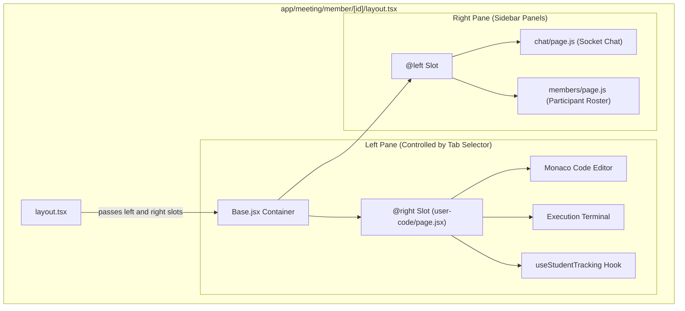
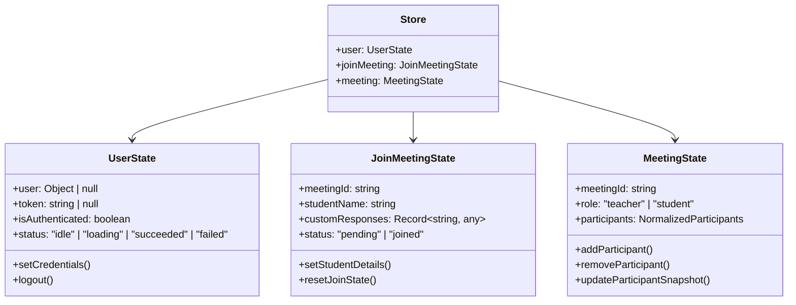
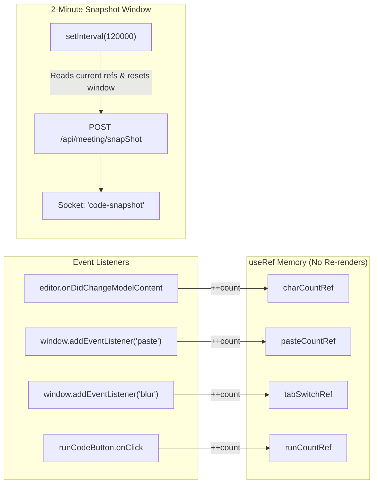

# Frontend Architecture & Component Documentation

This document covers the frontend architecture of **TeachView Live**, built on **Next.js 16.1.4 (App Router)**, **React 19.2.0**, **Redux Toolkit 2.11.2**, and **Tailwind CSS v4**.

---

## 1. Routing Architecture (Next.js App Router)

The application utilizes Next.js App Router conventions with route groups, dynamic routes, and parallel slot layouts.

### Directory & Route Map

```
app/
├── (auth)/                                  # Route group: Authentication
│   ├── login/page.js                        # Login form (Email/Password & Google OAuth)
│   ├── signup/page.js                       # Signup form with Zod client validation
│   ├── forgot-password/page.js              # 3-step OTP recovery flow
│   └── verify-email/page.js                 # 6-digit email confirmation page
├── dashboard/page.jsx                       # Host session hub & created meetings list
├── meeting/
│   ├── host/
│   │   ├── create/page.jsx                  # Meeting generator with dynamic fields builder
│   │   └── [id]/page.jsx                    # Live instructor monitoring room
│   └── member/
│       └── [id]/
│           ├── layout.tsx                   # Parallel route split layout (Base.jsx)
│           ├── page.jsx                     # Student pre-join entry & dynamic form
│           ├── @left/                       # Left parallel slot
│           │   ├── chat/page.js             # Live in-meeting chat
│           │   ├── members/page.js          # Room participant roster
│           │   └── default.js               # Slot fallback
│           └── @right/                      # Right parallel slot
│               ├── user-code/
│               │   ├── page.jsx             # Monaco editor & output terminal
│               │   └── UseStudentTracking.js# Low-overhead telemetry engine
│               └── default.js               # Slot fallback
├── layout.tsx                               # Global root layout (Providers, Toaster)
└── page.js                                  # Public landing page with showcase sections
```

---

## 2. Parallel Routes System (`@left` & `@right`)

The student coding environment ([`app/meeting/member/[id]/layout.tsx`](file:///c:/Users/AmanNagar/teachview-live/app/meeting/member/%5Bid%5D/layout.tsx)) uses Next.js Parallel Routes to load two independent component trees simultaneously.

### Layout Slot Topology



> [!NOTE]
> **Intentional Slot Swap in Layout**: In [`app/meeting/member/[id]/layout.tsx`](file:///c:/Users/AmanNagar/teachview-live/app/meeting/member/%5Bid%5D/layout.tsx#L33), the layout mounts the slots as:
> ```tsx
> <Base left={right} right={left} />
> ```
> This passes the `@right` slot (the Monaco code editor) into the main workspace on the left, and the `@left` slot (chat/members navigation) into the auxiliary panel on the right.

---

## 3. Global State Management (Redux Toolkit)

Global state is organized into three Redux slices within [`store/`](file:///c:/Users/AmanNagar/teachview-live/store):

### Redux Slices Overview



### 1. `userSlice.js`
- **File**: [`store/userSlice.js`](file:///c:/Users/AmanNagar/teachview-live/store/userSlice.js)
- **State**:
  - `user`: Authenticated user record (id, name, email, role).
  - `token`: Current access token string.
  - `isAuthenticated`: Boolean authorization status.
- **Key Reducers**: `setCredentials(state, action)`, `logout(state)`.

### 2. `joinMeetingSlice.js`
- **File**: [`store/joinMeetingSlice.js`](file:///c:/Users/AmanNagar/teachview-live/store/joinMeetingSlice.js)
- **State**:
  - `studentName`: Candidate's display name.
  - `customResponses`: Dynamic form field answers (e.g. `{ rollNumber: "CS-2024-01", semester: "6" }`).
- **Key Reducers**: `setStudentDetails(state, action)`, `clearStudentDetails(state)`.

### 3. `meetingSlice.ts`
- **File**: [`store/meetingSlice.ts`](file:///c:/Users/AmanNagar/teachview-live/store/meetingSlice.ts)
- **State Structure (Normalized)**:
  ```typescript
  interface MeetingState {
    meetingId: string | null;
    role: "teacher" | "student" | null;
    participants: {
      byId: Record<string, ParticipantData>;
      allIds: string[];
    };
  }
  ```
- **Participant Entity**:
  - `id`: Socket or user ID.
  - `name`: Student name.
  - `score`: Integrity score (0–100).
  - `tabSwitches`: Cumulative tab switch count.
  - `pasteCount`: Cumulative paste event count.
  - `latestSummary`: Latest AI 5-point evaluation.
  - `snapshots`: Array of historical snapshot payloads.

> [!WARNING]
> **Known Issue in `meetingSlice.ts`**:
> In [`store/meetingSlice.ts`](file:///c:/Users/AmanNagar/teachview-live/store/meetingSlice.ts#L67-L69), the `removeParticipant` reducer contains a shadowing bug:
> ```typescript
> state.participants.allIds = state.participants.allIds.filter((id) => id !== id);
> ```
> Because the filter parameter `id` shadows the payload `id`, `id !== id` always evaluates to `false`, clearing all participant IDs whenever any member leaves. Recommended fix: `id !== action.payload`.

---

## 4. Telemetry Hook: `useStudentTracking`

- **File**: [`app/meeting/member/[id]/@right/user-code/UseStudentTracking.js`](file:///c:/Users/AmanNagar/teachview-live/app/meeting/member/%5Bid%5D/@right/user-code/UseStudentTracking.js)

### Design Strategy: Zero-Rerender Tracking
Typing in a code editor emits high-frequency events. Updating React state on every keystroke causes frame drops and degraded editor performance. `useStudentTracking` uses mutable `useRef` handles to track telemetry silently.



### Metrics Collected
| Metric | Event Trigger | Purpose |
|---|---|---|
| `characterCount` | `onDidChangeModelContent` | Tracks overall code output and speed |
| `pasteCount` | `paste` event on editor DOM | Identifies sudden large block pastes |
| `tabSwitchCount` | `window.blur` / `visibilitychange` | Detects leaving the assessment tab |
| `executionCount` | Run code button trigger | Measures trial-and-error debugging effort |
| `idleTime` | Keystroke timestamp diff > 30s | Tracks pauses in active problem-solving |

---

## 5. Monaco Editor & Terminal Integration

- **Code Editor**: [`components/CodeEditor.jsx`](file:///c:/Users/AmanNagar/teachview-live/components/CodeEditor.jsx)
- **Terminal Output**: [`components/Terminal.jsx`](file:///c:/Users/AmanNagar/teachview-live/components/Terminal.jsx)

### Features
1. **Multi-Language Support**:
   - JavaScript (`language_id: 63`)
   - Python (`language_id: 71`)
   - C++ (`language_id: 54`)
   - Java (`language_id: 62`)
   - C (`language_id: 50`)
2. **Editor Configuration**:
   - Font: JetBrains Mono / Fira Code, 14px.
   - Automatic code formatting, bracket pair colorization, and mini-map.
3. **Execution Output**:
   - Integrated tabbed console showing Standard Output (`stdout`), Standard Error (`stderr`), and Compilation Error (`compile_output`).
   - Execution duration (seconds) and memory consumed (KB).

---

## 6. Instructor Dashboard Components

- **Main Dashboard**: [`app/meeting/host/[id]/page.jsx`](file:///c:/Users/AmanNagar/teachview-live/app/meeting/host/%5Bid%5D/page.jsx)
- **Student Monitoring Card**: [`components/admin/UserCard.jsx`](file:///c:/Users/AmanNagar/teachview-live/components/admin/UserCard.jsx)

### UserCard State Representation
Each student is displayed as a responsive card showing:
- **Status Indicator**: Online (green pulse) / Inactive.
- **Integrity Score Gauge**:
  - `80 - 100`: Green (Normal activity).
  - `50 - 79`: Yellow (Moderate paste or tab switches).
  - `0 - 49`: Red (Severe integrity anomalies).
- **Metric Badges**: Number of tab switches, pastes, and code executions.
- **Actions**:
  - "Inspect Code": Opens a read-only modal rendering the student's live Monaco editor content.
  - "AI Briefing": Opens modal rendering the 5-point generated summary:
    1. Overall Behavior
    2. Code Progress
    3. Potential Violations
    4. Code Quality & Logic
    5. Actionable Teacher Recommendation
