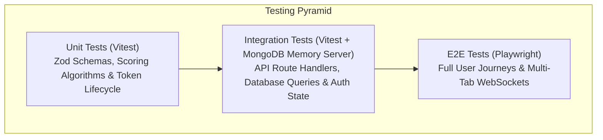

# Testing Architecture & Quality Assurance Guide

This document outlines the testing landscape, load-testing infrastructure, and recommended quality assurance strategies for **TeachView Live**.

---

## 1. Current Codebase Testing State

### Codebase Audit
An inspection of [`package.json`](file:///c:/Users/AmanNagar/teachview-live/package.json) reveals:
- No automated unit testing framework (e.g. Jest, Vitest) is currently installed or configured.
- No end-to-end testing framework (e.g. Playwright, Cypress) is currently present.
- A dedicated performance testing directory exists at [`k6-tests/`](file:///c:/Users/AmanNagar/teachview-live/k6-tests) containing synthetic test user definitions in [`k6-tests/users.json`](file:///c:/Users/AmanNagar/teachview-live/k6-tests/users.json).

---

## 2. Load Testing with k6

The project uses [k6](https://k6.io/) for concurrent user simulation, endpoint stress testing, and WebSocket load analysis.

### Test Fixtures: `k6-tests/users.json`
- **File**: [`k6-tests/users.json`](file:///c:/Users/AmanNagar/teachview-live/k6-tests/users.json)
- Contains an array of synthetic user profiles (names, emails, credentials) used to simulate students joining rooms concurrently.

### Recommended k6 Test Script
To execute a load test against the meeting snapshot and join endpoints, create and run the following k6 scenario:

```javascript
// k6-tests/stress-test.js
import http from 'k6/http';
import { check, sleep } from 'k6';

const users = JSON.parse(open('./users.json'));

export const options = {
  stages: [
    { duration: '1m', target: 50 },   // Ramp up to 50 concurrent students
    { duration: '3m', target: 200 },  // Ramp up to 200 students
    { duration: '2m', target: 200 },  // Sustained load
    { duration: '1m', target: 0 },    // Ramp down
  ],
  thresholds: {
    http_req_duration: ['p(95)<500'], // 95% of requests must complete under 500ms
    http_req_failed: ['rate<0.01'],   // Error rate must remain under 1%
  },
};

export default function () {
  const user = users[__VU % users.length];
  const baseUrl = __ENV.API_URL || 'http://localhost:3000';

  // 1. Simulate fetching meeting details
  const detailsRes = http.get(`${baseUrl}/api/meeting/getDetails/TEST_ROOM`);
  check(detailsRes, { 'getDetails returned 200': (r) => r.status === 200 });

  // 2. Simulate 2-minute periodic telemetry snapshot
  const snapshotPayload = JSON.stringify({
    code: "function solve() { return 42; }",
    language: "javascript",
    characterCount: 35,
    pasteCount: 0,
    tabSwitchCount: 0,
    executionCount: 1,
    studentName: user.name,
  });

  const headers = { 'Content-Type': 'application/json' };
  const snapRes = http.post(`${baseUrl}/api/meeting/snapShot`, snapshotPayload, { headers });
  check(snapRes, { 'snapshot returned 200': (r) => r.status === 200 });

  sleep(5);
}
```

### Running the k6 Test
```powershell
k6 run -e API_URL=http://localhost:3000 k6-tests/stress-test.js
```

---

## 3. Recommended Testing Strategy

To elevate the project to production readiness, implement the following 3-tier testing framework:



### Tier 1: Unit Testing (Vitest)
Unit tests should focus on isolated, pure business logic functions:
1. **Scoring Engine**:
   - Verify tab switch penalty scaling ($15 \times \text{count}$, capped at $45$).
   - Verify paste penalty scaling ($20 \times \text{count}$, capped at $40$).
   - Verify inactivity penalty ($50$ points when characters $< 10$).
2. **Validation Schemas**:
   - Verify Zod rejection of weak passwords (missing uppercase, number, or symbol).
   - Verify rejection of malformed email formats.
3. **JWT Expiration Math**:
   - Test rotation triggers for tokens expiring within 24 hours.

#### Sample Vitest Unit Test
```javascript
// test/unit/sessionSummary.test.js
import { describe, it, expect } from 'vitest';
import { calculateIntegrityScore } from '../../utils/sessionSummary';

describe('calculateIntegrityScore', () => {
  it('returns 100 for clean session with valid code', () => {
    const score = calculateIntegrityScore({ tabSwitchCount: 0, pasteCount: 0, characterCount: 150 });
    expect(score).toBe(100);
  });

  it('caps tab switch penalty at 45 points', () => {
    const score = calculateIntegrityScore({ tabSwitchCount: 10, pasteCount: 0, characterCount: 150 });
    expect(score).toBe(55); // 100 - 45
  });

  it('caps paste penalty at 40 points', () => {
    const score = calculateIntegrityScore({ tabSwitchCount: 0, pasteCount: 5, characterCount: 150 });
    expect(score).toBe(60); // 100 - 40
  });

  it('penalizes empty code with 50 points', () => {
    const score = calculateIntegrityScore({ tabSwitchCount: 0, pasteCount: 0, characterCount: 5 });
    expect(score).toBe(50); // 100 - 50
  });
});
```

---

### Tier 2: Integration Testing (API Routes & Database)
Test API Route Handlers using an in-memory database (`mongodb-memory-server`):
1. **Signup Staging**: Ensure record is placed into `EmailVerification` and NOT in `User`.
2. **OTP Verification**: Verify that submitting the correct OTP moves the document to `User` and purges the staging record.
3. **Meeting Access**: Verify that non-hosts cannot edit meeting configuration.

---

### Tier 3: End-to-End (E2E) Testing (Playwright)
Multi-browser E2E scenarios are critical for validating real-time interactions:
1. **Session Lifecycle**:
   - Teacher signs in and creates meeting room.
   - Student joins via link in an incognito context.
   - Student enters code in Monaco.
   - Teacher UI reflects student's score and code inspection modal within 2 minutes.
2. **Disconnection Handling**:
   - Student closes browser tab.
   - Teacher dashboard reflects `user-left` event and updates active participant count.
