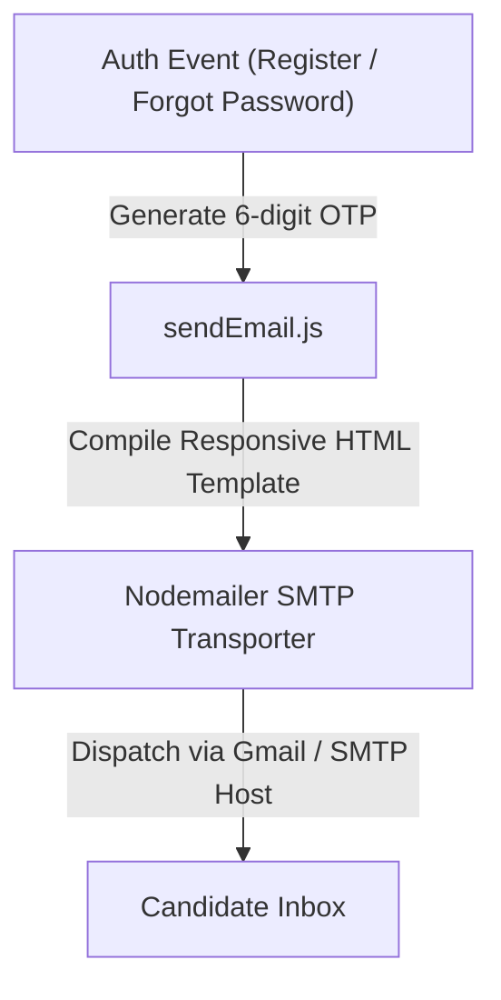

# Utilities, Services & Shared Helpers

This document details the shared utilities, service helpers, validation engines, and client libraries used across **TeachView Live**.

---

## 1. Directory & Module Inventory

```
lib/
├── apiClient.js             # Axios client with JWT auto-refresh interceptors
├── db.js                    # Mongoose connection singleton & pooling
├── getUserFromRequest.js    # JWT authorization guard for Route Handlers
├── jwt.js                   # Token generation, verification, and rotation logic
├── rateLimit.js             # Upstash Redis sliding window rate limiters
└── socketService.ts         # Socket.IO client singleton and typed event dispatcher

utils/
├── debounce.js              # Event debouncing and throttling helper
├── registerSchema.js        # Server-side Zod validation schemas
├── registerSchemaClient.js  # Client-side Zod schemas for React Hook Form
├── sendEmail.js             # Nodemailer service and HTML email templates
└── sessionSummary.js        # Heuristic integrity calculator and Gemini AI synthesizer
```

---

## 2. Validation Engine (`registerSchema.js` & `registerSchemaClient.js`)

- **Server Schema**: [`utils/registerSchema.js`](file:///c:/Users/AmanNagar/teachview-live/utils/registerSchema.js)
- **Client Schema**: [`utils/registerSchemaClient.js`](file:///c:/Users/AmanNagar/teachview-live/utils/registerSchemaClient.js)

### Validation Rules
Validation is powered by **Zod**. The registration schema enforces strict password security and email integrity:

```javascript
export const registerSchema = z.object({
  name: z
    .string()
    .min(2, "Name must be at least 2 characters")
    .max(50, "Name cannot exceed 50 characters")
    .trim(),
  email: z
    .string()
    .email("Please provide a valid email address")
    .toLowerCase()
    .trim(),
  password: z
    .string()
    .min(8, "Password must be at least 8 characters")
    .regex(/[A-Z]/, "Password must contain at least one uppercase letter")
    .regex(/[a-z]/, "Password must contain at least one lowercase letter")
    .regex(/[0-9]/, "Password must contain at least one number")
    .regex(/[^A-Za-z0-9]/, "Password must contain at least one special character"),
  role: z
    .enum(["teacher", "student"])
    .default("student")
});
```

---

## 3. Email Dispatch Service (`utils/sendEmail.js`)

- **File**: [`utils/sendEmail.js`](file:///c:/Users/AmanNagar/teachview-live/utils/sendEmail.js)
- **Transport**: Nodemailer via SMTP (`EMAIL_USER` and `EMAIL_PASS`)

### Email Operations


### Supported Email Templates
1. **Account Confirmation (`sendVerificationEmail`)**:
   - Dispatches 6-digit verification code.
   - Notifies user of 10-minute expiration window.
2. **Password Recovery (`sendPasswordResetEmail`)**:
   - Dispatches 6-digit OTP to authorize password reset.
   - Includes security warning advising user if they did not initiate the request.

---

## 4. Telemetry Scoring & AI Synthesizer (`utils/sessionSummary.js`)

- **File**: [`utils/sessionSummary.js`](file:///c:/Users/AmanNagar/teachview-live/utils/sessionSummary.js)

### Heuristic Scoring Algorithm
Computes an integrity score ($0 - 100$) before invoking the AI model:

```javascript
export function calculateIntegrityScore({ tabSwitchCount, pasteCount, characterCount }) {
  let score = 100;

  // Tab switch penalty: 15 points each, capped at 45
  const tabPenalty = Math.min(45, (tabSwitchCount || 0) * 15);
  
  // Paste penalty: 20 points each, capped at 40
  const pastePenalty = Math.min(40, (pasteCount || 0) * 20);
  
  // Inactivity / empty code penalty: 50 points
  const emptyPenalty = (!characterCount || characterCount < 10) ? 50 : 0;

  score -= (tabPenalty + pastePenalty + emptyPenalty);
  return Math.max(0, score);
}
```

### AI Evaluation & Fallback Behavior
- **Gemini Engine**: Injects telemetry metrics, previous snapshot summary, and current source code into a prompt requiring a strict 5-item evaluation structure:
  1. *Behavioral State*
  2. *Code Progression*
  3. *Integrity Concerns*
  4. *Code Quality Assessment*
  5. *Teacher Action Items*
- **Deterministic Fallback**: If `GEMINI_API_KEY` is not present in the runtime environment or if the remote API encounters an error, `sessionSummary.js` generates a structured fallback based on the heuristic penalty score:
  ```json
  {
    "score": 75,
    "behavior": "Active coding with occasional pauses.",
    "progress": "Code length: 142 characters. Recent modifications detected.",
    "violations": "1 tab switch detected during this 2-minute window.",
    "quality": "Basic structure present. No syntax errors detected.",
    "recommendation": "Monitor next window to verify if student returns to tab."
  }
  ```

---

## 5. HTTP Client with Auto-Refresh Interceptor (`lib/apiClient.js`)

- **File**: [`lib/apiClient.js`](file:///c:/Users/AmanNagar/teachview-live/lib/apiClient.js)
- **Library**: Axios 1.x

### Request Interceptor
Extracts the access token from `localStorage` or application memory and injects it into every outgoing HTTP call:
```javascript
config.headers.Authorization = `Bearer ${accessToken}`;
```

### Response Interceptor (Token Refresh Loop)
When an API responds with `401 Unauthorized`:
1. Pauses subsequent outbound requests into an execution queue.
2. Sends a refresh request with `withCredentials: true` to obtain a fresh access token.
3. Upon receiving the new token, updates the client header and replays all queued requests.
4. If refresh fails, purges credentials and triggers user logout.

> [!WARNING]
> **Verified Interceptor Endpoint Mismatch**:
> Lines 38–43 of [`lib/apiClient.js`](file:///c:/Users/AmanNagar/teachview-live/lib/apiClient.js#L38-L43) attempt to refresh tokens by calling `POST /api/auth/jwt`:
> ```javascript
> const res = await axios.post("/api/auth/jwt", {}, { withCredentials: true });
> ```
> However, the actual refresh route handler is located at [`app/api/login/refresh/route.js`](file:///c:/Users/AmanNagar/teachview-live/app/api/login/refresh/route.js). See [`docs/deployment.md`](file:///c:/Users/AmanNagar/teachview-live/docs/deployment.md) for details.

---

## 6. Real-Time Socket Service (`lib/socketService.ts`)

- **File**: [`lib/socketService.ts`](file:///c:/Users/AmanNagar/teachview-live/lib/socketService.ts)
- **Library**: `socket.io-client`

### Capabilities
- **Singleton Connection**: Ensures only one persistent WebSocket connection exists per browser session.
- **Room Subscriptions**: Methods to join and leave specific meeting rooms (`joinMeeting(roomId, payload)`).
- **Snapshot Dispatch**: Dispatches local telemetry snapshots to the teacher dashboard (`emitCodeSnapshot(snapshot)`).
- **Live Code Sync**: Emits code editor deltas when student types.
